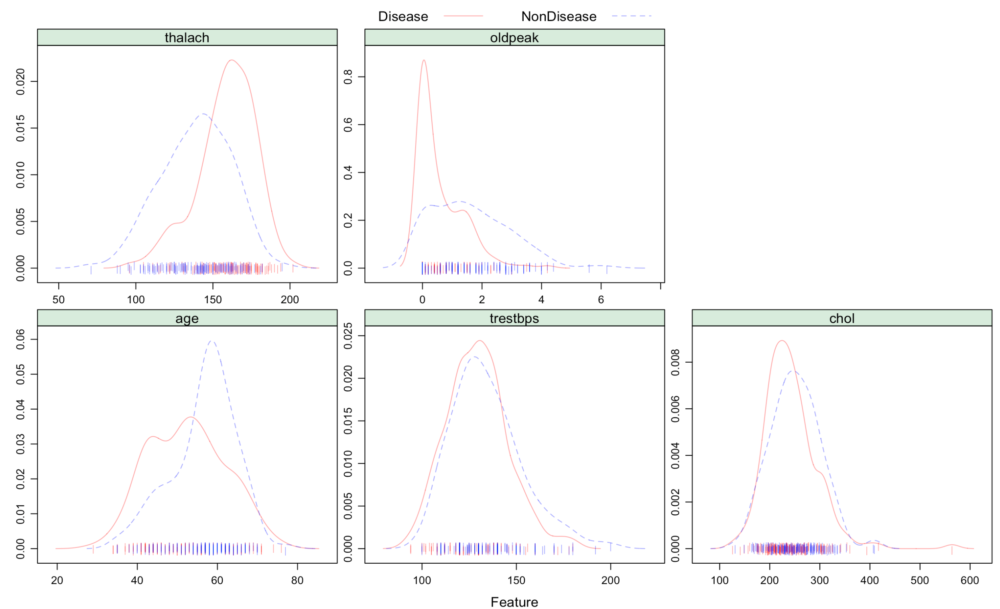
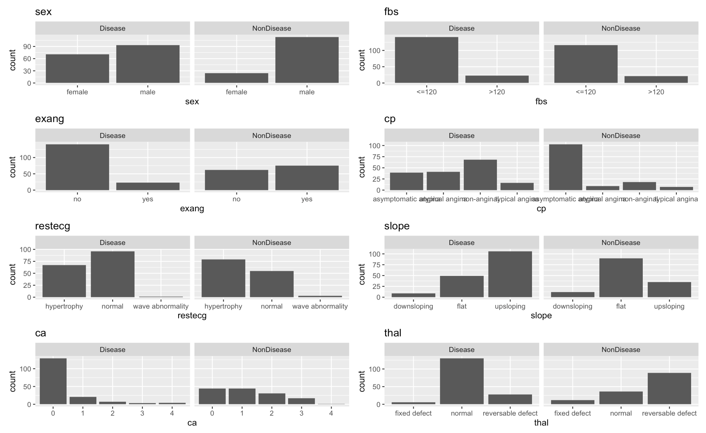
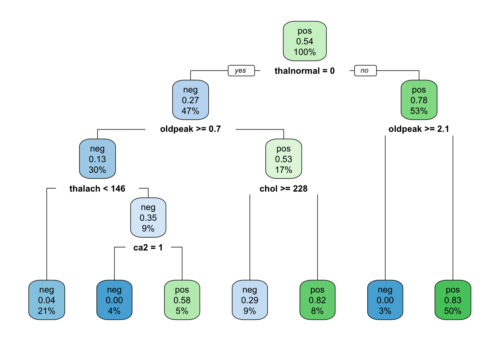
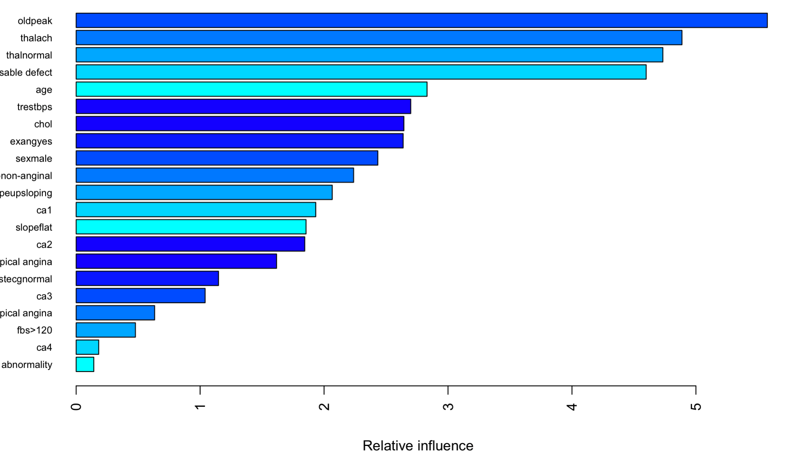
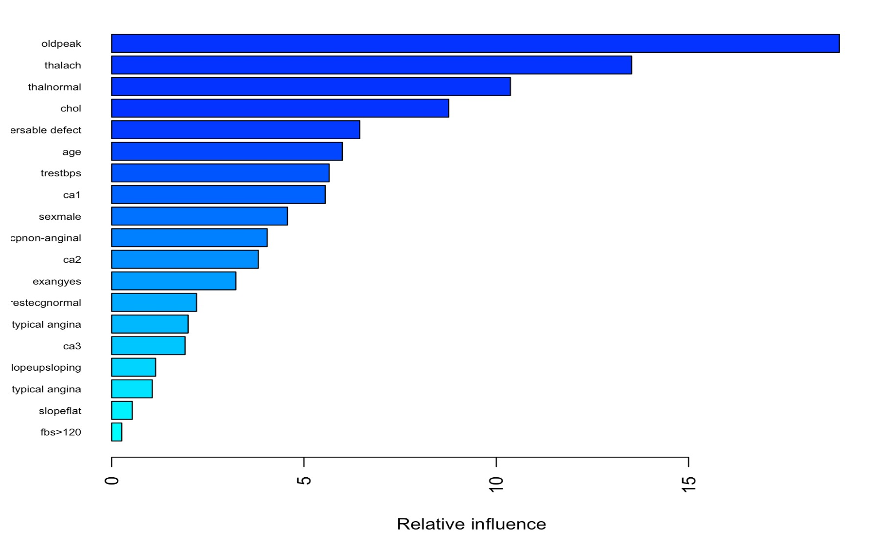
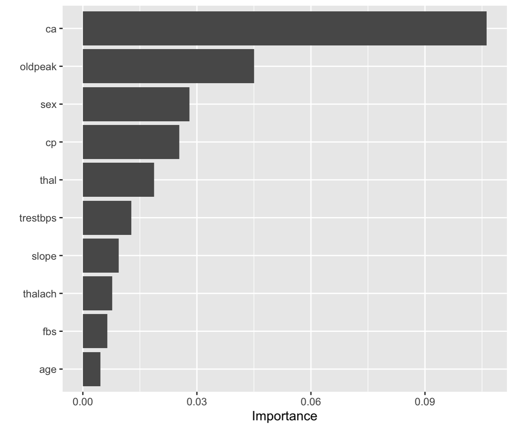
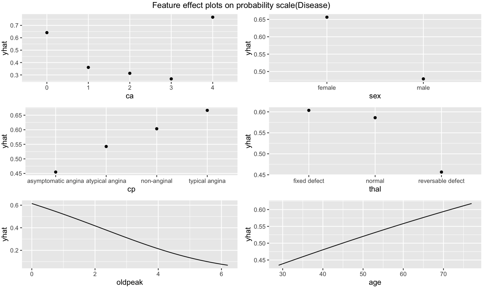

```{r setup, include=FALSE}
knitr::opts_chunk$set(echo = FALSE,warning = F,message = F)
library(tidyverse)
library(caret)
library(kableExtra)
load("test_Weijia.RData")
```

# Introduction

Heart disease is one of the leading cause of death for both men and women all over the world. Heart disease detection based on typical clinical features is being increasingly critical to population health. It is a desirable way to help people enhance self protection ability and prevent faults. In this report, we built several predictive models to predict the heart disease. 

There are 303 observations, 14 predictions in the data set and 2 missing values.

- age: age in years **continuous variable**

- sex: (1 = male; 0 = female) **categorical variable**

- cp: chest pain type **categorical variable**

- trestbps: resting blood pressure (in mm Hg on admission to the hospital) **continuous variable**

- chol: serum cholestoral in mg/dl **continuous variable**

- fbs: (fasting blood sugar &gt; 120 mg/dl) (1 = true; 0 = false) **categorical variable**

- restecg: resting electrocardiographic results **categorical variable**
 
- thalach: maximum heart rate achieved **continuous variable**

- exang: exercise induced angina (1 = yes; 0 = no) **categorical variable**

- oldpeak: ST depression induced by exercise relative to rest **continuous variable**

- slope: the slope of the peak exercise ST segment **categorical variable**

- ca: number of major vessels colored by flourosopy **categorical variable**

- thal: a blood disorder called thalassemia, 3 = normal; 6 = fixed defect; 7 = reversable defect **categorical variable**

- target: 1 = disease; 0 = not disease **response**

Among the predictors, there are 8 categorical variables and 5 continuous variables. We first recoded all the categorical variables with its true meaning for further usage. Then, we removed missing values and changed all character variables into factor.

In this report, we aim to built a model to predict whether a person is likely to get heart disease or not. We use cross validation to compare the prediction performance of these models.


# Exploratory analysis/visualization

Among the continuous variables, thalach/oldpeak/age have very different distribution among those disease and non-disease population. Disease group tend to have higher *thalach* and smaller *oldpeak*.

Among the categorical variables, the distribution of fbs is similar among disease and non-disease groups while others are not similarly distributed. 

```{r, echo=FALSE,warning= FALSE, message = FALSE, echo=FALSE,out.width='90%', out.height='40%',fig.pos='h', fig.align = "center"}

```

```{r, echo=FALSE,warning= FALSE, message = FALSE, echo=FALSE,out.width='90%', out.height='40%',fig.pos='h', fig.align = "center"}

```

# Models

This is a binary classification problem. In this report, we mainly focus on the following models: GLM (logistic regression with penalty term), KNN model, Tree model, Random Forest model, Boosting and Support vector machine. We use all predictor into the models. And we set ROC as the metric.

We randomly split the data into 75% train set and 25% test set. We built our model based on the train set and did prediction on the test set. We used repeated CV for models comparison.

## GLM

Firstly, we use elsetic model, which is a combination with lasso regression and ridge regression. There are two tuning parameters in the model: $\alpha \in [0,1]$: $Ridge: \alpha = 0$; $Lasso: \alpha = 1$ and $\lambda$: the penalty coefficient. 

```{r, echo=FALSE,warning= FALSE, message = FALSE, echo=FALSE,out.width='90%', out.height='50%',fig.pos='h', fig.align = "center"}
plot(glmn.fit.c, xTrans = function(x) log(x))
```

From the plot, we can see that when $\alpha = 0.2, \lambda = 0.011$, we get the best model with largest AUC. The Accuracy of the best model from GLM is 0.7733. Sensitivity is 0.7805 and Specificity is 0.7647.

```{r, echo=FALSE,warning= FALSE, message = FALSE, echo=FALSE,out.width='90%', out.height='50%',fig.pos='h', fig.align = "center"}
vip::vip(glmn.fit.c, num_features = 20, method = "model") + 
  ggtitle("GLM")
```

From the importance plot, we can see the level of ca is the most important feature in prediction the disease status.

## KNN

We also used unsupervised learning method KNN to model this problem. When using KNN method, it's important to do preProcess: center and scale the data. Then the tuning parameter in KNN method is the number of neighborhood. We choose to tune from 1 to 150. From the plot, when the number of neighborhood is 11, we get the largest AUC. The accuracy of KNN is 0.8533, sensitivity is 0.9024 and specificity : 0.7941

```{r, echo=FALSE,warning= FALSE, message = FALSE,out.width='90%', out.height='50%',fig.pos='h', fig.align = "center"}
plot(knn.fit.c)
```

## Tree
Besides, we apply several tree-based methods to model Heart data, including classification tree, random forests and boosting.First, let's see the result of tree model. For complexity parameter cp, we set it to range from $e^{-10}$ to $e^{-5}$. As the plot shows, the AUC reaches the peak when cp equals to `r rpart.fit.c$bestTune`. The accuracy of the best tree model  is 0.7067, sensitivity is 0.8293 and Specificity is 0.5588. The test error rate is 0.2933.

```{r, echo=FALSE,warning= FALSE, message = FALSE,out.width='90%', out.height='50%',fig.pos='h', fig.align = "center"}
ggplot(rpart.fit.c, highlight = TRUE)
```

The following plot shows the structure of tree. 
```{r, echo=FALSE,warning= FALSE, message = FALSE, echo=FALSE,out.width='90%', out.height='40%',fig.pos='h', fig.align = "center"}

```

## Random Forest
To use random forest, we tune minimal node size (1:6) and the number of randomly selected predictors (1:6), with Gini index as the criterion for tree growing. As a result, the largest AUC value can be obtaiined when the minimal node size and the number or predictors are set to be 3 and 1, respectively.
The accuracy, sensitivity and specificity of the best random forest model is 0.8533, 0.9024 and 0.7941, respectively. And the test error is  0.1467.

```{r, echo=FALSE,warning= FALSE, message = FALSE,out.width='90%', out.height='50%',fig.pos='h', fig.align = "center"}
ggplot(rf.fit.c, highlight = TRUE)
```

The following plot shows the variance importance and it turns out that oldpeak is of the most 
importance while the resting electrocardiographic results showing abnormality is of the least importance among all variables.

```{r, echo=FALSE,warning= FALSE, message = FALSE, echo=FALSE,out.width='90%', out.height='40%',fig.pos='h', fig.align = "center"}

```

## Boosting

In addition, we use boosting model for Heart data. Then we tune some parameters. We choose the number of trees from $(2000,3000,4000)$, the interaction depth from 1 to 6, and the shrinkage parameters $\lambda$ from $(0.001,0.003,0.005)$. And we fix the minimum number of observations in the terminal nodes of the trees 1.  From the plot we find that when the number of trees is 3000, the interaction depth is 6, the shrinkage equals 0.001, we get the largest AUC. The Accuracy of the best model from Boosting is 0.7867, Sensitivity is 0.8049 and Specificity is 0.7647. The test error rate is 0.2133.  

```{r, echo=FALSE,warning= FALSE, message = FALSE,out.width='90%', out.height='50%',fig.pos='h', fig.align = "center"}
ggplot(gbmB.fit, highlight = TRUE)
```

The following plot shows the variance importance. Here we can find that oldpeak is the most important variable while the fasting blood sugar is the least important variable.

```{r, echo=FALSE,warning= FALSE, message = FALSE, echo=FALSE,out.width='90%', out.height='40%',fig.pos='h', fig.align = "center"}

```

## SVM

Finally, we use support vector machine (both linear kernel and radical kernel model) to train the data. 

For linear kernel model, the tuning parameter cost $C$ is chose from $e^{-5}$ to $e$. When $C = 0.115568$, we gain the largest AUC. 

```{r, echo=FALSE,warning= FALSE, message = FALSE,out.width='90%', out.height='50%',fig.pos='h', fig.align = "center"}
ggplot(svml.fit, highlight = TRUE)
```

For radical kernel model, cost $C$ is chose from $e^{-1}$ to $e^4$, $\gamma$(sigma in the plot) is chose from $e^{-6}$ to $e^{-2}$. When $C = 31.32588, \gamma = 0.0094$, we gain the largest AUC. 

```{r, echo=FALSE,warning= FALSE, message = FALSE,out.width='90%', out.height='50%',fig.pos='h', fig.align = "center"}
ggplot(svmr.fit, highlight = TRUE)
```

The following table shows some results for two SVM models.
```{r}
matr %>% knitr::kable(
    align = rep('c', 15),
    longtable = F, 
    booktabs = T, 
    escape = T,
    digit = 3
  ) %>% 
  kable_styling(
    latex_options = c("hold_position","repeat_header")
  )
```

## Model comparison & final model
```{r}
bwplot(resamp)
```

Based on resampling methods, we compare the predictive ability between models. As a result, the support vector machine model with linear kernel has a better predictive performance in terms of AUC and thus selected as the final model to predict heart disease condition. Using test dataset, we evaluate its test performance. The accuracy, sensitivity and specificity of the final model is 0.813, 0.794 and 0.829, respectively.

```{r, echo=FALSE,warning= FALSE, message = FALSE,out.width='90%', out.height='50%',fig.pos='h', fig.align = "center"}

```

Using AUC as the metric, we compute the variable importance scores, which indicates that `ca`, `oldpeak`, `sex`, `cp` and `thal` as the 5 most imporatnt variables. Next, we construct partial dependence plots for these top 5 features as well as `age` on the probability scale, and our interpretation is in reference to predicting having heart disease. The plot shows that people who are 
female, with the major blood vessels of 0 or 4, typical anginia, fixed defect of thalassemia, low oldpeak value, and older age have a higher probability of having heart disease. Most of the result make sense except that people with 4 major blood vessels seem to have higher probability of heart disease, which may be a result of chance since there're only two subjects of 4 major blood vessels in training set.

```{r, echo=FALSE,warning= FALSE, message = FALSE,out.width='90%', out.height='50%',fig.pos='h', fig.align = "center"}

```

# Conclusions
Multiple models, including GLM, KNN, Tree model, Random Forest, Boosting and Support vector machine are used to predict heart disease. The support vector machine model with linear kernel has the best predictive performance.

Heart disease can be predicted based on some useful predictors, such as (1)Number of major vessels; (2)ST depression induced by exercise relative to rest; (3)Sex; (4)Chest pain type; (5)Thalassemia defect type and etc. Generally, probability of heart disease is higher in people who are female, suffer from typical anginia, fixed defect of thalassemia and have lower number of major blood vessels and low oldpeak value. Besides, the risk of heart disease also increases with age.

This dataset is relatively small and to better predict heart disease, datasets with larger sample size may be needed in the future.
